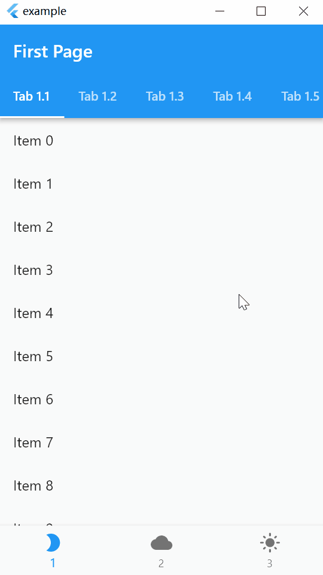

# Nested Scrolling Views

Flutter nested scrolling views.

## Usage

Replace flutter's views with the following views and use them nested.

| View                        | Controller           | Flutter               |
| --------------------------- | -------------------- | --------------------- |
| NestedPageView              | NestedPageController | PageView              |
| NestedTabBarView            | TabController        | TabBarView            |
| NestedSingleChildScrollView | ScrollController     | SingleChildScrollView |

## Gotchas

1. Nested views always stay alive.
2. NeverScrollableScrollPhysics invalid.
3. Nested non-nested views with the same scroll direction will result in weird scrolling.